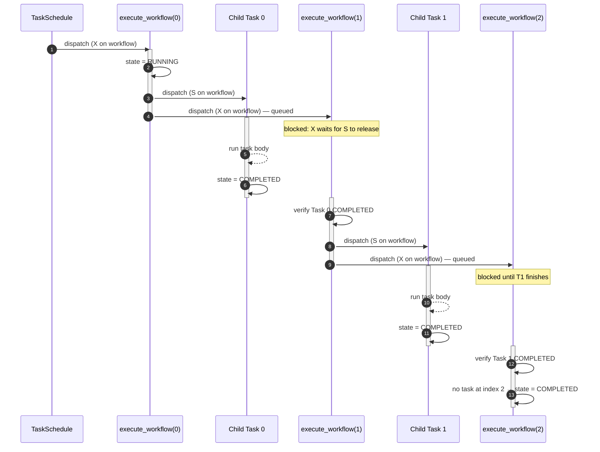

# pulp-workflow

> **Warning:** This is a community plugin and is not officially supported. Scheduling tasks incorrectly can cause serious issues in your Pulp instance. Always test in a development environment first before applying changes to production.

A Pulp plugin that introduces `Workflow` — a named, ordered pipeline of tasks
dispatched sequentially.

A `Workflow` owns one or more `WorkflowTask` rows. Each task records the
`task_name`, `task_args`, `task_kwargs`, and any `reserved_resources` to use
when dispatching it. Workflows are immutable after creation: to change a
workflow, cancel it (if it has not yet started) and create a new one.

## Endpoints

| Method | URL | Description |
|--------|-----|-------------|
| GET | `/pulp/api/v3/workflows/` | List workflows |
| POST | `/pulp/api/v3/workflows/` | Create a workflow (with tasks) |
| GET | `/pulp/api/v3/workflows/<pk>/` | Retrieve a workflow |
| PATCH | `/pulp/api/v3/workflows/<pk>/` | Cancel a waiting workflow (body: `{"state": "canceled"}`). Returns 409 if the workflow has already started; only `"canceled"` is accepted as the target state. |

## How execution works

When a workflow is created, TaskSchedule dispatches a single `execute_workflow`
task. Rather than looping inside one long-running task (which would pin a
worker for the entire duration of the pipeline), `execute_workflow` runs one
step at a time and re-dispatches itself for the next step. Each invocation
either transitions the workflow to `running` (on the first step) or inspects
the previous step's child task and fails the workflow if it did not complete.
If there are no more `WorkflowTask` rows at the next index, the workflow is
marked `completed`.

Sequencing relies on pulpcore's tasking locks rather than polling. Every
invocation dispatches the child task with a **shared** lock on the workflow's
resource string (`pulp_workflow:workflow:<pk>`) and then dispatches the next
`execute_workflow` continuation with an **exclusive** lock on the same
resource. Because the exclusive lock cannot be granted while the shared lock
is held, the continuation is guaranteed to wait until the child task ends —
without blocking a worker on a polling loop. This keeps concurrent workflows
from deadlocking when their count meets or exceeds the worker count.

The diagram below shows two consecutive tasks. `S` denotes a shared lock and
`X` denotes an exclusive lock on the workflow resource.

If any child task ends in a non-`completed` state, or if dispatching a child
raises, the next `execute_workflow` invocation records the failure on the
workflow (`error` field, including the child's traceback when available),
transitions the workflow to `failed`, and stops the chain.

## Task groups

Every workflow is backed by a pulpcore `TaskGroup`. On creation, the workflow
allocates a `TaskGroup(description="Workflow: <name>")` in the workflow's
domain and links it via the `task_group` field on the Workflow resource. The
dispatched child tasks and the `execute_workflow` continuations are members
of that group. The initial `execute_workflow` task itself is dispatched by
the `TaskSchedule` created at workflow-create time and is *not* a member of
the group. Membership means:

- `GET /pulp/api/v3/task-groups/<pk>/` lists every task the workflow has
  spawned in one place.
- `GET /pulp/api/v3/tasks/?task_group=<pk>` filters tasks to that workflow.
- Existing client tooling (`monitor_task_group`,
  `TaskGroupOperationResponse`) works against workflows the same way it does
  for replication and pulp-import.
- A child task can discover that it is part of a workflow via
  `TaskGroup.current()` without `pulp_workflow` having to plumb that context
  through itself.

The group's `all_tasks_dispatched` flag is `False` while the workflow is
running and flipped to `True` exactly once the workflow reaches a terminal
state (`completed`, `failed`, or `canceled`).