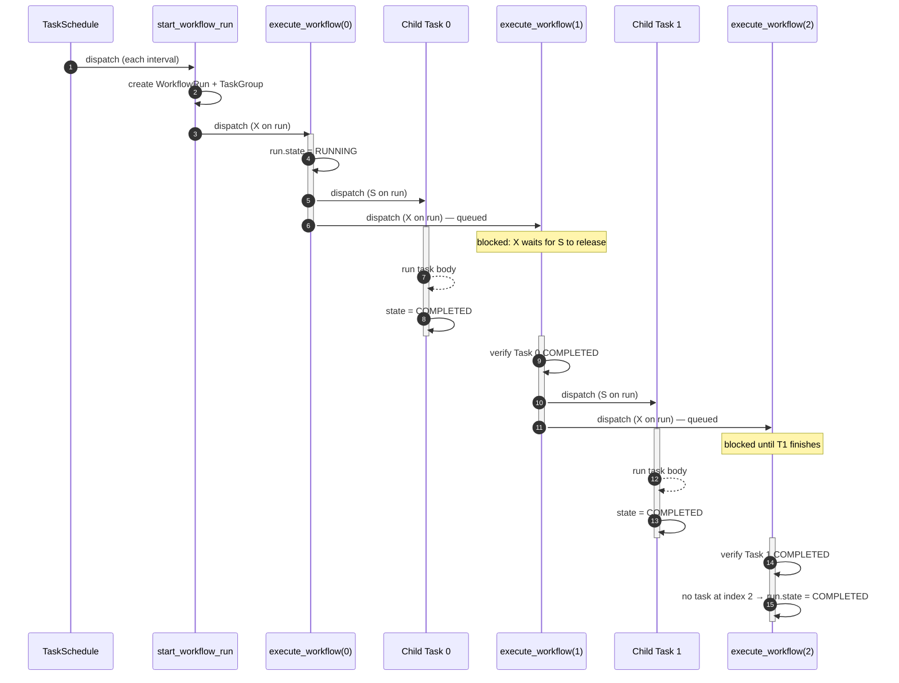
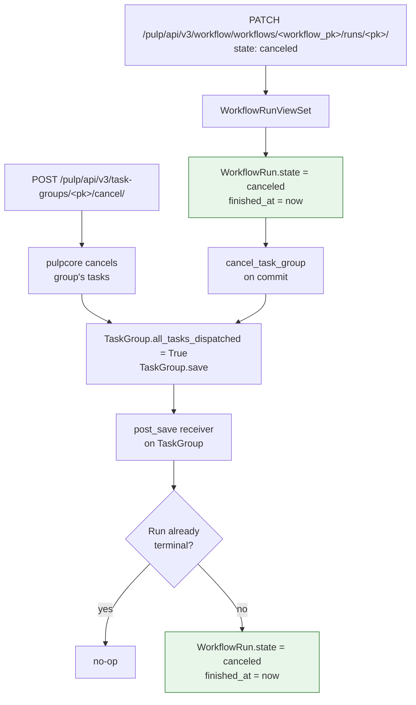

# pulp-workflow design

This document describes the internal design of the `pulp-workflow` plugin:
how workflows are scheduled and execute, how they integrate with pulpcore's
`TaskGroup`, and how cancellation propagates.

## Definitions vs. runs

A `Workflow` is a *definition* plus a *schedule*: it owns the ordered
`WorkflowTask` rows, any lifecycle `callbacks`, and the schedule
(`start_time` / `dispatch_interval`). It does **not** carry execution state.

Each execution is a separate `WorkflowRun`. A run carries the state that used
to live on the workflow: `state`, `started_at`, `finished_at`, `error`, the
most-recently-dispatched `current_task`, and its own `task_group`. Modeling
runs separately lets a periodic workflow accumulate a history of runs while
still keeping at most one run in flight at a time (see below).

## Scheduling and periodic workflows

When a workflow is created, a pulpcore `TaskSchedule` is registered
(`name = "pulp_workflow.workflow:<pk>"`) that dispatches `start_workflow_run`
at `start_time`:

- If `dispatch_interval` is null, the schedule fires **once** (pulpcore sets
  `next_dispatch = None` after the first dispatch).
- If `dispatch_interval` is set, the schedule fires **repeatedly** on that
  interval. pulpcore advances `next_dispatch` by the interval after each
  dispatch, so a new run starts every interval.

`start_workflow_run` is deliberately tiny: it creates a `WorkflowRun` and its
`TaskGroup`, then dispatches the first `execute_workflow` step and returns.
Before creating a run it checks for an existing unfinished run of the same
workflow and skips if one is found, so a periodic workflow never has more than
one run in flight at a time — overlapping runs are not created.

## How a run executes

`start_workflow_run` dispatches a single `execute_workflow` task against the
new run. Rather than looping inside one long-running task (which would pin a
worker for the entire duration of the pipeline), `execute_workflow` runs one
step at a time and re-dispatches itself for the next step. Each invocation
either transitions the run to `running` (on the first step) or inspects the
previous step's child task and fails the run if it did not complete. If there
are no more `WorkflowTask` rows at the next index, the run is marked
`completed`.

Sequencing relies on pulpcore's tasking locks rather than polling. Every
invocation dispatches the child task with a **shared** lock on the run's
resource string (`pulp_workflow:run:<run_pk>`) and then dispatches the next
`execute_workflow` continuation with an **exclusive** lock on the same
resource, passing the child task's pk forward as `prev_task_pk`. Because the
exclusive lock cannot be granted while the shared lock is held, the
continuation is guaranteed to wait until the child task ends — without blocking
a worker on a polling loop. This keeps concurrent runs from deadlocking when
their count meets or exceeds the worker count.

The diagram below shows two consecutive tasks. `S` denotes a shared lock and
`X` denotes an exclusive lock on the run resource.

If any child task ends in a non-`completed` state, or if dispatching a child
raises, the next `execute_workflow` invocation records the failure on the
run (`error` field, including the child's traceback when available),
transitions the run to `failed`, and stops the chain.

## Task groups

Every workflow *run* is backed by a pulpcore `TaskGroup`. `start_workflow_run`
allocates a `TaskGroup(description="Workflow run: <name>")` in the workflow's
domain and links it via the `task_group` field on the `WorkflowRun`. The
dispatched child tasks and the `execute_workflow` continuations are members of
that group. The `start_workflow_run` task itself is dispatched by the
`TaskSchedule` and is *not* a member of the group. Membership means:

- `GET /pulp/api/v3/task-groups/<pk>/` lists every task a run has spawned in
  one place.
- `GET /pulp/api/v3/tasks/?task_group=<pk>` filters tasks to that run.
- Existing client tooling (`monitor_task_group`,
  `TaskGroupOperationResponse`) works against runs the same way it does
  for replication and pulp-import.
- A child task can discover that it is part of a run via
  `TaskGroup.current()` without `pulp_workflow` having to plumb that context
  through itself.

The group's `all_tasks_dispatched` flag is `False` while the run is
running and flipped to `True` exactly once the run reaches a terminal
state (`completed`, `failed`, or `canceled`).

## Cancellation

A single run can be canceled by `PATCH`ing the run with
`{"state": "canceled"}` or by canceling its backing `TaskGroup` directly.
Both paths converge on the same terminal state: `WorkflowRun.state = canceled`,
`finished_at` set, `TaskGroup.all_tasks_dispatched = True`, and any
in-flight or queued child tasks (including the `execute_workflow`
continuation) canceled. `PATCH` on an already-terminal run returns 409.

A whole workflow can be *stopped* by `PATCH`ing the workflow with
`{"state": "canceled"}`: its `TaskSchedule` is deleted (so no further runs are
created) and each of its in-flight runs is canceled. This is idempotent.

If the workflow is stopped before its schedule has created any run (for
example a workflow with a future `start_time`), there is no run to cancel and
none is recorded; the stop simply removes the schedule. Callbacks are not
currently supported for cancellation: a canceled run (including the `finished`
wildcard) produces no callback tasks.

The `TaskGroup` cancel path is bridged back to the run row via a
`post_save` receiver on `TaskGroup`, so cancellation initiated outside the
workflow viewset still terminates the `WorkflowRun` correctly.

